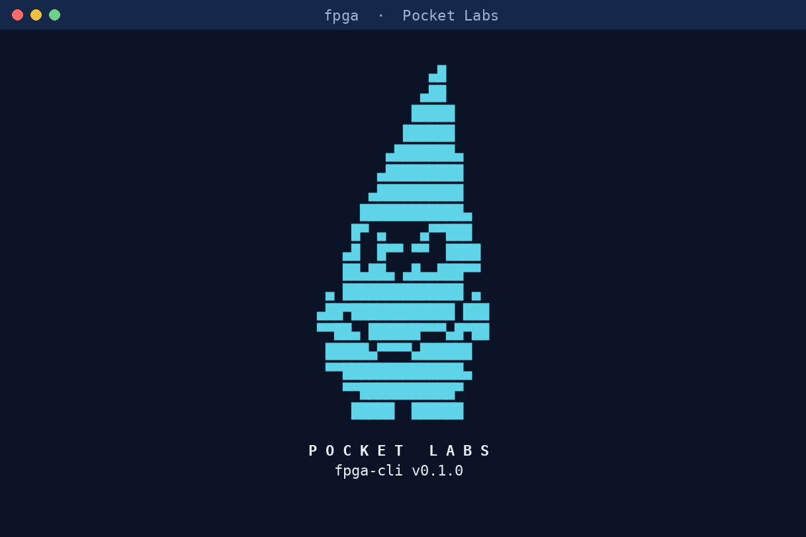
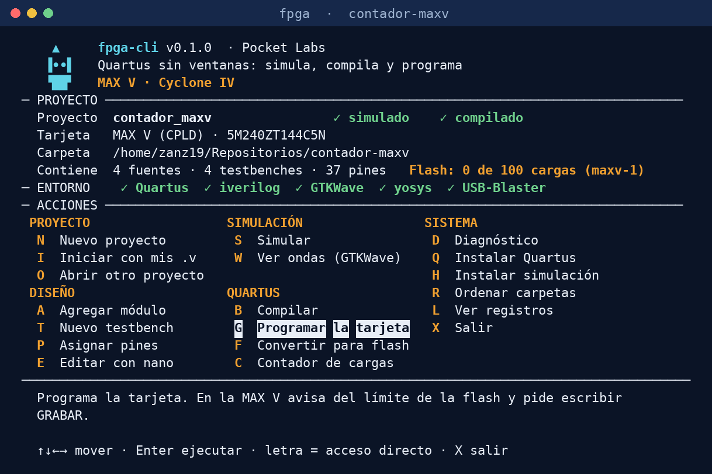

<p align="center">
  
</p>

# fpga-cli

**Quartus Prime Lite desde la terminal, con un menú TUI.** Crea el proyecto, simula con testbench, mira las ondas, compila y programa tarjetas
**MAX V (CPLD)** y **Cyclone IV E (FPGA)** sin abrir la interfaz gráfica de Quartus.

*English:* a small terminal/TUI front end for the Quartus Prime Lite flow on MAX V and Cyclone IV E boards: simulate (Icarus Verilog), view waves (GTKWave),
build and program (Quartus), from the command line or a text menu. An experiment by Pocket Labs, MIT licensed.

## Qué es y qué no es

fpga-cli es un **experimento pequeño**: una capa delgada que ejecuta desde la terminal los mismos programas que Quartus ya trae
(`quartus_sh`, `quartus_cpf` y `quartus_pgm`) y, para simular, Icarus Verilog con GTKWave. Cada paso del flujo de diseño es un comando, y un menú
de texto (TUI) los reúne, con la salida de Quartus dentro de la misma ventana.

**No busca competir con la interfaz gráfica de Quartus ni reemplazarla.** Esa herramienta cubre mucho más (IP, Platform Designer, SignalTap, Chip Planner…)
y sigue siendo la opción para proyectos grandes. Aquí el interés es otro: explorar qué tan cómodo y reproducible puede ser el flujo de una
FPGA o un CPLD pequeño cuando se maneja desde una terminal, con una TUI.

## De dónde surge

Surgió al preparar una conferencia introductoria de FPGA con demostraciones en dos tarjetas. El ciclo de editar, simular, compilar y cargar se repite
decenas de veces, y en la interfaz gráfica implica muchas ventanas. La idea fue probar si un flujo en terminal, con comandos que se pueden repetir igual
y un menú que muestra todo en un solo lugar, lo hacía más ágil y más fácil de explicar. Cada ejecución queda en un registro y toda opción del menú
equivale a un comando que también se puede escribir.

## Para quién es

- **Estudiantes que empiezan con FPGA o CPLD** (electrónica, mecatrónica, computación) y tienen una MAX V o una Cyclone IV.
- **Quien trabaja en Linux y prefiere la terminal.** Se desarrolló y probó solo en Linux Mint.
- **Quien enseña o hace demostraciones:** los pasos son comandos, los proyectos tienen siempre la misma estructura y la herramienta avisa antes de gastar
  los ciclos limitados de la flash de la MAX V.
- **No es para** proyectos que dependan de IP de Intel o de Platform Designer, ni para otras familias de dispositivos mientras no se agregue su archivo de tarjeta
  (ver *Añadir una tarjeta*).

## Cómo funciona

| Paso del flujo | Comando | Qué usa por debajo |
|---|---|---|
| Crear el proyecto | `fpga new`, `fpga add`, `fpga new-tb` | plantillas y asistentes |
| Asignar pines | `fpga pin` | genera el `.tcl` y el `.sdc` |
| Simular y ver ondas | `fpga sim`, `fpga wave` | Icarus Verilog y GTKWave |
| Compilar | `fpga build` | `quartus_sh` |
| Programar | `fpga prog` | `quartus_pgm` y `quartus_cpf` |

Con `fpga` sin argumentos se abre el menú. Muestra el proyecto, el entorno detectado y las acciones, sugiere el siguiente paso, y cada acción corre en una
ventana del propio menú, con la salida desplazable y el registro de la ejecución:

<p align="center">
  
</p>

Dos cosas pensadas para estas tarjetas: la **MAX V** cuenta sus cargas (la flash garantiza solo 100) y exige escribir `GRABAR`; en la **Cyclone IV**,
`fpga prog` pregunta si cargar a RAM, a flash o solo convertir, para no pisar el programa de fábrica sin querer.

## Inicio rápido

```bash
git clone https://github.com/Zanz-19/fpga-cli.git && cd fpga-cli
./install.sh udev        # enlace ~/.local/bin/fpga + regla udev del USB-Blaster
fpga doctor              # qué herramientas encuentra y si ve el USB-Blaster
fpga new mi-proyecto --board maxv --dir ~/proyectos    # o --board cyclone4
cd ~/proyectos/mi-proyecto && fpga                     # abre el menú dentro del proyecto
```

Faltan Quartus y las herramientas de simulación: `fpga install-quartus` y `fpga install-tools` explican cómo instalarlas (más abajo).

## Cómo se hizo

Autor: José Ramón Sánchez Acosta · Pocket Labs. Se desarrolló con apoyo de un asistente de IA (Claude, de Anthropic) para escribir y probar el código;
las pruebas con las tarjetas reales las hizo el autor. Lo que está verificado y lo que no se detalla en *Estado: qué está verificado*.

---

# Referencia

## Requisitos

| Qué | Cómo |
|---|---|
| Python 3.11 o superior | Linux Mint 22 lo trae; en Mint 21: `pip install tomli` |
| Simulación (iverilog, vvp, gtkwave, yosys) | `fpga install-tools` las deja **dentro de esta carpeta** (`tools/`), sin sudo; o `sudo apt install iverilog gtkwave yosys` |
| **Quartus Prime Lite 25.1** | Es la última versión que soporta MAX V y Cyclone IV E (las posteriores ya no). `fpga install-quartus` te guía (ver abajo); ModelSim no hace falta |
| USB-Blaster sin sudo | `./install.sh udev` |

Quartus se busca en el `PATH`, en `QUARTUS_BIN` y en `~/intelFPGA_lite/*/quartus/bin` o `~/altera_lite/*/quartus/bin`.

## Instalación

```bash
cd ~/repos/fpga-cli
./install.sh udev      # enlace ~/.local/bin/fpga + regla udev
fpga doctor            # qué herramientas encuentra y si ve el USB-Blaster
```

## Herramientas de simulación: `fpga install-tools`

`fpga install-tools` descarga **OSS CAD Suite** (YosysHQ, paquete autocontenido del repositorio oficial de GitHub) y lo extrae en
`fpga-cli/tools/oss-cad-suite`: unos 750 MB de descarga y 2.5 GB en disco, sin sudo ni apt. Incluye `iverilog`, `vvp`,
`gtkwave` y `yosys`; `fpga` los usa **antes** que los del sistema, y `fpga doctor` muestra de dónde sale cada uno.
`tools/` está en `.gitignore` para que no se suba a GitHub. Opciones: `--tag AAAA-MM-DD` (versión fija), `--force`, `--dry-run`.
No hay suma de verificación publicada que comprobar: se confía en la conexión HTTPS con el repositorio oficial.
Quartus **no** va aquí: lo instala el instalador de Altera en su propia carpeta (`~/altera_lite/25.1std`).

## Instalar Quartus: `fpga install-quartus`

Altera obliga a iniciar sesión para descargar sus archivos y a aceptar su licencia, así que la descarga no se puede
automatizar. Hay dos caminos; la herramienta detecta cuál tienes en `~/Descargas` (o `--dir`):

**Opción 1, la más simple: instalador oficial `qinst`** (pestaña *Installer (Recommended)*, 67.7 MB)

- `qinst-lite-linux-25.1std-1129.run`: verifica su SHA1, lo lanza y registra dónde quedó Quartus.
  Es un instalador gráfico (en modo texto si no hay pantalla) que descarga los componentes mientras instala.
- En la lista de componentes (los nombres que muestra el instalador):
  - **Marcado:** *Quartus Prime Lite Edition > Quartus Prime*.
  - **Márcalos tú**, porque vienen desmarcados: *Cyclone IV device support* y *MAX II, MAX V device support*.
  - **Desmárcalos**, porque vienen marcados: *Questa-Altera FPGA and Starter Editions* (simulamos con iverilog),
    *Cyclone V device support* y *MAX 10 FPGA device support*.
  - Con eso bajas unos 2.3 GB y ocupa unos 8.8 GB. Carpeta sugerida: `~/altera_lite/25.1std`.

**Opción 2: tres archivos** (pestaña *Individual Files*), instalación desatendida

- `QuartusLiteSetup-25.1std.0.1129-linux.run` (1.9 GB), `cyclone-25.1std.0.1129.qdz` (466 MB), `max-25.1std.0.1129.qdz` (11.4 MB),
  todos en la misma carpeta. Verifica el SHA1 de cada uno, el espacio libre y, con tu `ACEPTO`, instala sin ventanas
  (`--manual` fuerza este camino si también tienes `qinst`).

```bash
fpga install-quartus                   # sin archivos: lista las dos opciones y abre la página oficial
fpga install-quartus                   # con archivos: verifica e instala
fpga install-quartus --interactive     # opción 2 con los menús del instalador, sin banderas
fpga install-quartus --register RUTA   # no instala: solo registra un Quartus que ya tengas
fpga install-quartus --dry-run         # muestra lo que haría
```

Al terminar, la ruta de Quartus queda en la configuración de `fpga`, así que **no hace falta tocar el PATH** para usarlo con `fpga`
(para usarlo fuera, la herramienta te da la línea de `~/.bashrc`). Nombres y SHA1 están en `quartus.toml`, tomados de la página
el 2026-10-05; si Altera cambia los archivos, se actualizan ahí. Las banderas del modo desatendido de la opción 2
(`--mode unattended ... --accept_eula 1`) **no están verificadas** en tu máquina.

## Uso

```bash
fpga boards                         # tarjetas soportadas
fpga pins --board maxv              # señales y pines de una tarjeta
fpga new blink-maxv --board maxv    # pregunta la carpeta y la plantilla (o --dir RUTA --template blink|empty)

cd ~/repos/blink-maxv
fpga sim            # iverilog + vvp  -> dump.vcd
fpga wave           # gtkwave
fpga build          # proyecto + compilación con Quartus
fpga prog           # programar (con avisos, ver abajo)
```

## Proyectos propios (el blink es solo una plantilla)

`fpga new` ofrece dos plantillas: **blink** (un parpadeo que ya funciona, para estrenar la tarjeta) y **empty** (solo el módulo
top con el reloj, para empezar de cero). Con `--template empty` no queda nada del ejemplo.

```bash
fpga new mi-diseno --board cyclone4 --template empty   # proyecto vacío
fpga init --board maxv --top mi_top                    # adopta archivos .v que ya tienes (en la carpeta actual o -C RUTA)

fpga add contador              # nuevo módulo contador.v; se suma a las fuentes
fpga add alu --port "input clk" --port "input [3:0] a" --port "output reg [7:0] q"   # con sus puertos ya escritos (repetible)
fpga new-tb contador           # tb_contador.v con parámetros, entradas y salidas ya conectados y reloj generado
fpga new-tb contador --force   # lo regenera si cambiaste los puertos del módulo (SOBRESCRIBE lo que le hayas escrito)
fpga new-tb alu --stim "#0 rst_n=0" --stim "#100 rst_n=1 a=4'b1010"   # con estímulos (repetible); se validan contra las entradas del módulo
fpga sim tb_contador           # con varios testbenches se indica cuál; wave abre la forma de onda de ese
fpga pin led[3:0] led3 led2 led1 led0   # puertos del top -> señales de la tarjeta (fpga pins las lista)
fpga pin                       # asignaciones actuales; --remove PUERTO quita una
```

- **Varios archivos.** `sources` en `fpga.toml` admite listas y comodines (`"*.v"`, `"src/**/*.v"`); se resuelven en cada
  compilación. Los testbenches nunca van a Quartus y los archivos ocultos (`.fpga/`) se ignoran. Acepta `.v`, `.sv` y `.vhd`
  (el VHDL llega a Quartus, pero no al simulador, que es de Verilog).
- **El top.** `top` en `fpga.toml` es el módulo de más arriba; el resto se conecta instanciándolo desde ahí.
- **`fpga new-tb`** lee la cabecera del módulo (formato ANSI, el que lleva los puertos entre paréntesis); si la tuya es de
  estilo antiguo, deja la instancia con un TODO.
- **Pines.** Un puerto de un bus se asigna como `led[3]`; `fpga pin 'led[3:0]' a b c d` reparte de más a menos significativo.

## Estructura de un proyecto

`fpga new` crea cada tipo de archivo en su carpeta, y la raíz se queda limpia:

```
mi-proyecto/
├── fpga.toml        tarjeta, dispositivo, pines y la lista de archivos
├── src/             los módulos y el top (lo que tú escribes)
├── tb/              los testbenches
├── sim/             archivos de simulación (.vvp); se regeneran
├── waves/           formas de onda (.vcd) para GTKWave; se regeneran
├── build/           todo lo de Quartus: el .tcl y el .sdc generados, el proyecto, los reportes
│   └── output_files/   los archivos de carga: .sof (RAM), .pof y .jic (flash)
├── Makefile         atajos que sirven sin esta herramienta (make sim, make build)
└── .gitignore       ignora sim/, waves/ y todo build/ salvo el .tcl y el .sdc
```

- Los `$dumpfile("x.vcd")` de tus testbenches caen en `waves/` sin tocarlos, porque la simulación corre desde esa carpeta.
- En `fpga.toml`, `sources` y `testbenches` llevan rutas desde la raíz (`src/contador.v`, `tb/tb_contador.v`) y admiten comodines (`src/**/*.v`).
- **Proyectos anteriores (estructura plana).** Siguen funcionando tal cual, con todo suelto en la raíz. Para ordenarlos:

```bash
fpga tidy --dry-run     # muestra qué se movería, sin tocar nada
fpga tidy               # pide confirmación (--yes para saltarla)
```

`fpga tidy` mueve los archivos a su carpeta (con `git mv` si están versionados, así el historial se conserva), actualiza `fpga.toml`,
regenera el `.tcl` y el `.sdc` dentro de `build/`, ajusta el `.gitignore` y reemplaza el `Makefile` (si no estaba en git, deja el anterior como
`Makefile.bak`). No mueve los `.v` que no sean fuentes ni testbenches del proyecto: los lista. En el menú es la tecla **R**.
Después de ordenar hay que volver a compilar: Quartus regenera su proyecto dentro de `build/`.

## Cómo funciona `new`

- **`fpga new`** pregunta la ruta (propone la última usada) y crea ahí la carpeta del trabajo con `git init`.
  El guion de la carpeta (`blink-maxv`) se cambia por guion bajo en el módulo y el proyecto (`blink_maxv`).
- Los demás comandos funcionan dentro de la carpeta del trabajo, con `fpga -C RUTA <comando>`, o, si estás en
  otra carpeta y hay terminal, **te preguntan la ruta del trabajo**.
- Cada trabajo guarda en `fpga.toml` su tarjeta, dispositivo y pines (copiados de la tarjeta). Para cambiar un pin, usa `fpga pin` o edita `fpga.toml` y corre `fpga project`.
- `--dry-run` (en `project`, `build`, `prog` y `tidy`) muestra lo que haría sin hacerlo.

## El menú: `fpga` sin argumentos

```bash
fpga          # abre el menú (también: fpga tui, o fpga -C RUTA para abrirlo en un proyecto)
```

Un menú de lanzamiento en la terminal (solo biblioteca estándar de Python, sin instalar nada):

- **Panel de proyecto:** nombre, tarjeta, carpeta, si está simulado y compilado, cuántas fuentes, testbenches y pines tiene, y en la MAX V
  cuántas cargas de flash lleva registradas. **Panel de entorno:** qué herramientas encuentra y si ve el USB-Blaster.
- **Acciones:** nuevo proyecto, iniciar con tus `.v`, abrir otro (recientes o ruta), agregar módulo, nuevo testbench, asignar pines,
  simular, ver ondas, compilar, programar, convertir para flash (Cyclone IV, no toca la tarjeta), contador de cargas, diagnóstico, instalaciones y ver registros.
- **Siguiente paso sugerido:** el cursor arranca (y vuelve tras cada acción) en lo que toca según el estado del proyecto: simular, luego compilar, luego programar.
  Se manejan con flechas y Enter, o con la letra resaltada de cada opción. X sale.
- **Cada opción ejecuta el mismo comando** que escribirías (`fpga sim`, `fpga build`, `fpga prog`…): los avisos y confirmaciones de la
  MAX V (escribir `GRABAR`) son exactamente los mismos.
- **Logo de Pocket Labs:** al abrir el menú aparece un instante el gnomo (cualquier tecla lo salta; con `FPGA_NO_SPLASH=1` no aparece) y un gnomo pequeño
  queda en el encabezado. El dibujo se adapta al alto de la terminal y, sin UTF-8 (`FPGA_CLI_ASCII=1`), usa solo ASCII. Para cambiar el logo:
  `python3 scripts/make_logo.py assets/pocket-labs.jpeg` regenera `fpga_cli/logo.py` desde una imagen en negro sobre fondo claro (necesita Pillow y numpy
  solo para regenerar; la herramienta no los usa).
- **Ventanas dentro del menú:** el comando corre en una ventana del propio menú, sin volver a la terminal. Su salida (la de Quartus incluida)
  se desplaza con ↑↓, RePág/AvPág, Inicio y Fin; mientras corre se sigue el final. Lo que el comando pide (el nombre de un proyecto,
  la tarjeta, `GRABAR`…) se **escribe en la línea «responder»** de esa ventana y se envía con Enter: la herramienta nunca responde por ti,
  y lo que se teclea antes de que se abra la ventana se descarta. **Ctrl-C** interrumpe el comando (en una grabación de flash puede dejarla a medias);
  **Esc** no abandona un comando vivo. Al terminar se ve el código de salida y Enter o Esc vuelven al menú. Los datos de entrada previos
  (nombre del módulo, módulo del testbench, ruta de un proyecto) se piden en un cuadro donde se escribe; Esc lo cancela sin tocar nada.
  **GTKWave** sigue siendo una ventana externa: se abre aparte y el menú queda libre.
- **Editar con nano (E):** eliges el archivo (fuentes, testbenches o `fpga.toml`, por número o por su ruta) y se abre `nano` sobre él; al cerrarlo
  (Ctrl-X) vuelves al menú, que te dice si guardaste cambios y qué toca después (un cambio en una fuente deja «simulado» en ✗). No hay editor
  dentro del menú. Si `nano` no está instalado, lo dice: `sudo apt install nano`.
- **Asistentes que se escriben:** *Agregar módulo* pide el nombre y luego los puertos de uno en uno (`input clk`, `input [3:0] a`, `output reg [7:0] q`;
  también `in b[3:0]`). *Nuevo testbench* pide los estímulos (`#100 rst_n=1` espera 100 ns y asigna; `#50 a=4'b1010 b=3`; solo `#200` para esperar),
  y te muestra las entradas del módulo. Cada línea se valida al escribirla: si está mal, el error dice por qué y la línea queda para corregirla.
  Enter vacío termina, `borrar` quita la última y Esc cancela todo sin crear nada. Equivale a `fpga add --port …` y `fpga new-tb --stim …`.
- **Registro de cada ejecución:** cada acción deja un archivo en `<proyecto>/.fpga/logs/` (fecha, comando, todo lo que se vio, lo que escribiste
  y el código de salida; fuera de un proyecto, en `~/.config/fpga-cli/logs/`). Se conservan los últimos 60. **L** en el menú los lista y los abre.
  `.fpga/` ya está en el `.gitignore` de los proyectos, así que los registros no se suben a GitHub.
- **Asignar pines** es una pantalla donde se **escribe** (nada se elige por accidente): `led led0`, `led[3:0] led3 led2 led1 led0`,
  `quitar led`, `?led` para listar señales, y `salir` o Esc para volver. Un renglón mal escrito da un error y no toca `fpga.toml`.
- Entra en una terminal estándar de 80x24 (mínimo). Con `FPGA_CLI_ASCII=1` usa solo caracteres ASCII (útil en terminales sin UTF-8).

## Programar: MAX V

La flash de configuración del 5M240Z garantiza **solo 100 ciclos** de borrado/programación. Por eso `fpga prog`:

1. exige que `output_files/*.pof` sea más nuevo que tus fuentes (si no, te manda a `fpga build`);
2. muestra el dispositivo, el archivo, la garantía y las cargas registradas, y avisa si no simulaste esta versión;
3. te hace escribir **`GRABAR`** (no hay opción para saltarlo); a partir de 80 cargas avisa que estás cerca,
   y con 100 pide además **`SUPERAR LIMITE`**;
4. cuenta la carga **solo si `quartus_pgm` terminó bien**.

El contador va **por tarjeta física** (`unit` en `fpga.toml`, `maxv-1` por defecto; usa `--unit` en `fpga new`
si tienes otra) y se guarda en `~/.local/share/fpga-cli/counters.json`, no en el proyecto, porque el límite es del chip.
Es una estimación: no cuenta lo que grabes con otras herramientas. Ver o ajustar: `fpga counter`.

## Programar: Cyclone IV

`fpga prog` pregunta (o `--target ram|flash`):

- **RAM**: `.sof` por JTAG. Rápido, se pierde al apagar.
- **Flash**: convierte el `.sof` a `.jic` (JTAG indirecto) y lo graba en la M25P16 **por el mismo conector JTAG**: no hay que cambiar el cable.
  La FPGA arranca sola. **Sobrescribe lo que traiga la tarjeta** (p. ej. su demostración de fábrica). Alternativa por AS (`.pof`): ver `boards/cyclone4.toml`.
- **Solo convertir** (no toca la tarjeta): `fpga prog --target flash --convert-only`, la opción 3 del menú de `fpga prog`, o la tecla F en el menú.

## Estado: qué está verificado

Versión 0.1.0, experimental. Probada en **Linux Mint** con **Quartus Prime Lite 25.1std (Build 1129)** y las dos tarjetas de abajo.

| | |
|---|---|
| **Probado con la MAX V real** | El flujo completo `fpga new` → `sim` → `wave` → `build` → `prog` desde la estructura de carpetas (`src/`, `tb/`, `build/`…): `.tcl` generado, dispositivo `5M240ZT144C5`, restricción de reloj, pines, `RESERVE_ALL_UNUSED_PINS` y `quartus_pgm -m jtag -o p;archivo.pof` (borra, programa y verifica). Dos diseños: un parpadeo y un contador de 4 dígitos con los 4 displays y las 4 teclas (37 pines, 138 de 240 LEs). El clon de USB-Blaster (`09fb:6001`) funciona sin sudo con la regla udev |
| **Probado con la Cyclone IV real** | `build`, carga a RAM (`.sof`, `quartus_pgm -m jtag`: JTAG ID `0x020F10DD`, `Configuration succeeded`), la **conversión a `.jic`** (`quartus_cpf -c -d EPCS16 -s EP4CE6`, sin errores) y dos diseños: un parpadeo y un contador de 0 a 9 con display de 7 segmentos y botones |
| Verificado solo con un Quartus falso | La lógica de avisos, confirmación y contador de cargas de la MAX V, los menús y los asistentes (más de 180 pruebas: `python3 -m unittest discover -s tests`); `install-tools` con un paquete falso (con el paquete real se probó la extracción) |
| **Sin verificar** | **La grabación de la flash de la Cyclone IV** (`quartus_pgm -m jtag -o p;archivo.jic`): no se hizo a propósito, porque esa flash trae el programa de demostración de fábrica; el instalador desatendido de `install-quartus` (la instalación se hizo con el instalador gráfico `qinst`, lanzado a mano); los switches, el buzzer y la cabecera de expansión de la MAX V |

Primera vez en una tarjeta nueva: `fpga doctor` → `fpga build --dry-run` → `fpga build` → `fpga prog --dry-run`.
Los comandos de la Cyclone IV para la flash están en `boards/cyclone4.toml` (`flash_convert`, `flash_program`; con la alternativa AS comentada):
si Quartus protesta, se corrigen ahí sin tocar el código.

## Añadir una tarjeta

Copia `boards/maxv.toml` o `boards/cyclone4.toml`, cambia familia, dispositivo, reloj y pines. `device` es el código de pedido
(el impreso en el chip) y `quartus_device` el nombre que acepta Quartus: p. ej. `5M240ZT144C5N` frente a `5M240ZT144C5`
(Quartus rechaza la `N` final, que solo indica empaquetado sin plomo). `[program] mode` es
`flash_only` (con `limit`/`warn_at`) o `ram_or_flash`.

## Fases opcionales

Recortar Quartus a un backend mínimo o contenerizarlo, programar por OpenOCD/SVF y explorar bitstreams quedan
fuera de esta primera versión.

## Licencia

MIT (ver [LICENSE](LICENSE)). El logo de Pocket Labs (`assets/pocket-labs.jpeg` y el dibujo derivado en `fpga_cli/logo.py`) es una marca del autor y no queda cubierto por esa licencia.
